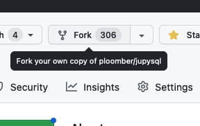
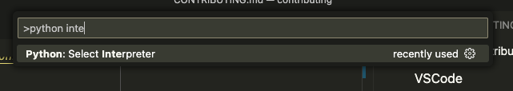
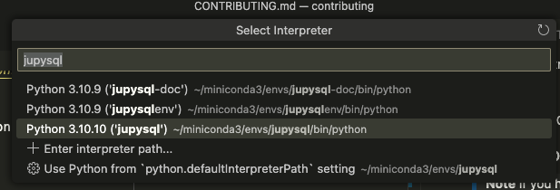
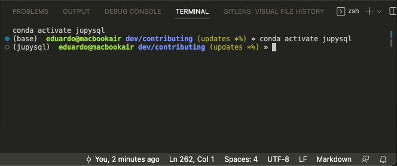
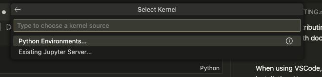
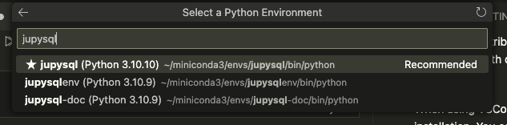

# Contributing

> **Note**
> If you get stuck in the contribution process, send us a message on [Slack](https://ploomber.io/community) and we'll help you.


This is a general guide applicable to all our projects (JupySQL, Ploomber, sklearn-evaluation, ploomber-engine, etc.). However, there might be particular details in some repositories so check out the `CONTRIBUTING.md` (located in the root directory) for the project you want to contribute to.

For a more detailed introduction to open-source contributions, check out our [blog post](https://ploomber.io/blog/open-source/).

This guide will help you configure your development environment; by the end of it, you'll be able to make changes to the code (or documentation), test them locally, and prepare your changes for a Pull Request.

> **Note**
> If you're contributing with documentation (API docs, tutorials, etc.), check out the [doc contribution](documentation/README.md) document as well.

## Pre-requisites

Setting up your environment requires [miniconda](https://docs.conda.io/en/latest/miniconda.html), once installed, verify it's working with:

```sh
conda --version
```

If `conda` is activated, you should see `(base)` as the prefix of your terminal prompt.

You also need `git`, ensure it's working by running the following:

```sh
git --version
```

Continue once `conda` and `git` are working.

## Creating a `conda` environment

Each Ploomber project you contribute we'll live in a separate `conda` environment,
so let's first create a base environment to manage the others.

Create a `ploomber-base` environment:

```sh
conda create --name ploomber-base python=3.10 --yes
```

Activate the environment and install `pkgmt`:

```sh
conda activate ploomber-base
pip install pkgmt --upgrade
```

Verify installation:

```sh
pkgmt --help
```

If you don't see any errors, continue. Otherwise, message us on [Slack](https://ploomber.io/community)

## Forking and cloning the repository

To contribute to one of our projects, you need to fork it by clicking on this button:



Then, click on "Create fork"


This will create a copy of the repository under your username:

```
https://github.com/YOUR_USERNAME/REPOSITORY_NAME
```

Once you forked it, use the terminal to clone the repository:

```sh
git clone https://github.com/YOUR_USERNAME/REPOSITORY_NAME
```


## Setup

> **Warning**
> Some of our projects have a `tasks.py` file in the root directory (e.g., [Ploomber](https://github.com/ploomber/ploomber)), if that's the case for the project you want to contribute to, go to the [next section](#setup-projects-with-taskspy)


First, ensure your current directory is the folder where you cloned the repository. For example if using Linux or macOS:

```sh
cd REPOSITORY_NAME
```

Now, let's setup your development environment. First, activate your base environment:

```sh
conda activate ploomber-base
```

Now, let's install the dependencies:

```sh
# if you want to build the documentation locally, pass --doc
pkgmt setup --doc

# this command will create a conda environment for you
pkgmt setup
```

By the end of the `pkgmt setup` command, you'll see something like this:

```sh
conda activate ENV_NAME
```

This is because the `pkgmt setup` command will create another conda environment that's
configured to contribute to the project you forked.

Before continuing, ensure you activate the environment:

```sh
conda activate ENV_NAME
```

> **Note**
> You have to repeat this process for every project you contribute to. For example,
> if you start contributing to [JupySQL](https://github.com/ploomber/jupysql), and
> then you are contributing to
> [ploomber-engine](https://github.com/ploomber/ploomber-engine), you'll have to setup
> again.

Now, let's configure your [IDE (e.g., JupyterLab, VSCode)](#configuring-your-ide)

## Setup (projects with `tasks.py`)

If the project you want to contribute has a `tasks.py` file, follow these instructions.

Let's setup your development environment:

```sh
pip install invoke --upgrade

# if you want to build the documentation locally, pass --doc
invoke setup --doc

# this command will setup the development environment
invoke setup
```

By the end of the `invoke setup` command, you'll see something like this:

```sh
conda activate ENV_NAME
```

This is because the `invoke setup` command will create another conda environment that's
configured to contribute to the project you forked.

Before continuing, ensure you activate the environment:

```sh
conda activate ENV_NAME
```

> **Note**
> You have to repeat this process for every project you contribute to. For example,
> if you start contributing to [JupySQL](https://github.com/ploomber/jupysql), and
> then you are contributing to
> [ploomber-engine](https://github.com/ploomber/ploomber-engine), you'll have to setup
> again.


Now, let's configure your [IDE (e.g., JupyterLab, VSCode)](#configuring-your-ide)
## Configuring your IDE

This section will show you how to configure your IDE. First, open a terminal and
activate the environment for the project you'll be working on:

```sh
conda environment ENV_NAME
```

**Important:** Take note on the `ENV_NAME`, since we'll need this value later.
### Verifying conda environment

Now, execute the following:

```sh
python -c 'import sys; print(sys.prefix)'
```

You should see something like this if you installed miniconda:

```txt
path/to/miniconda3/envs/ENV_NAME/bin/python
```

Or like this, if you installed Anaconda:

```txt
path/to/anaconda3/envs/ENV_NAME/bin/python
```

> **Warning**
> If the output does not contain `miniconda` or `anaconda`, send us a message on
> [Slack](https://ploomber.io/community) and we'll help you.


- [Click here](#jupyterlab) if you'll be using JupyterLab for contributing
- [Click here](#vscode) if you'll be using VSCode for contributing

### JupyterLab

> **Warning**
> Starting JupyterLab from another environment or Anaconda's graphical user
> interface might create issues. We highly recommend you install and start JupyterLab
> from the same conda environment, as described below.

If you want to use JupyterLab for developing, ensure you install and start it from
the same conda environment:

```sh
# activate environment
conda activate ENV_NAME

# install JupyterLab
pip install jupyterlab

# start JupyterLab
jupyter lab
```

Once JupyterLab opens, open a notebook, a terminal:


And run the following, in the notebook:

```python
import sys; print("sys.prefix:", sys.prefix)
```

Verify that the printed value is the same as you saw in the
[Verifying conda environment](#verifying-conda-environment) section (the `ENV_NAME`).


Now, open a terminal and run the following:

```sh
python -c 'import sys; print("sys.prefix:", sys.prefix)'
```

Then, ensure that what's printed is `ENV_NAME`; if it's not, then you'll have to
run `conda activate ENV_NAME` every time you open a terminal.

> **Warning**
> Once a package is imported in Jupyter, changes to the source code are not
> automatically reflected. You need to restart the kernel or enable
> [autoreload](https://ipython.readthedocs.io/en/stable/config/extensions/autoreload.html)


If you'll be contributing with code, go to the [Coding](#coding) section, if you'll
be contributing with documentation, go to the
[Building documentation](#building-documentation) section.
### VSCode

When using VSCode, you must ensure that you're using the right Python installation.
You can easily set this by opening the
[command paletter](https://code.visualstudio.com/docs/getstarted/userinterface#_command-palette),
then typing `Python: Select Interpreter`:




Then, type the `ENV_NAME`. For example, if I'm
setting up JupySQL, `ENV_NAME` is `jupysql`, so once I type it, I'll see this:




And type enter. Then, whenever you open a terminal, the conda environment will be automatically activated:



If it doesn't execute automatically, you'll have to run the `conda activate ENV_NAME` command every time you open a terminal.

#### VSCOde notebooks

If you want to write notebooks from VSCode, you need to ensure that the right kernel is enabled. Once you open a notebook, click on "Select Kernel":


Then, select the `Python Environments...` option and type Enter:



Finally, type the `ENV_NAME`, choose the option that matches the location of the conda environment and press Enter:



## Building documentation

> **Note**
> If you have issues building the documentation, send us a message on [Slack](https://ploomber.io/community) and we'll help you.

We build the documentation on each Pull Request; however, you might run it locally for faster previews. We've standardized the setup process for the most part but send us a message on [Slack](https://ploomber.io/community) if you have issues.

The steps are the same as in the [Setup](#setup), but you need to ensure you pass the `--doc` argument to the `pkgmt setup` (or `invoke setup`) command. Once you'r ready, ensure you activate the conda environment (printed at the end of the command):

```sh
conda activate ENV_NAME
```

To build the docs:

```sh
pip install pkgmt --upgrade
pkgmt doc
```

In some cases, the documentation cache might cause issues, to perform a clean doc build:

```sh
pkgmt doc --clean
```

> **Warning**
> If the project you're contributing to has a `tasks.py` file in the root directory (e.g., [Ploomber](https://github.com/ploomber/ploomber)), you must run `invoke doc` to build the docs. If you have issues, send us a message on [Slack.](https://ploomber.io/community). The source code for the `invoke` commands is in `tasks.py` so you might want to check it out as well.


To learn more about writing docs, see [documentation/README.md](documentation/README.md)

## Coding

### Linting/Formatting

Before running the tests on GitHub, we lint the code, notebooks and documentation with `flake8`, if you want to check your code locally:

```sh
pip install pkgmt --upgrade
pkgmt lint
```

> **Note**
> `pkgmt lint` is a wrapper around [`flake8`](https://flake8.pycqa.org/en/latest/) that lints `.py`, `.ipynb` and `.md` files.

If you encounter errors, you need to fix them; otherwise your Pull Request will fail. Most errors can be fixed with automated formatting:

```sh
pip install pkgmt --upgrade
pkgmt format
```

> **Note**
> `pkgmt lint` is a wrapper around [`black`](https://github.com/psf/black) and [`nbQA`](https://github.com/nbQA-dev/nbQA) that formats `.py`, `.ipynb` and `.md` files.


To automatically lint your code before pushing:

```sh
pip install pkgmt --upgrade
pkgmt hook
```

The command above will install a git pre-push hook. To uninstall:

```sh
pkgmt hook --uninstall
```

### Maintaining backwards compatibility

When breaking the API, we give heads up nnotice to our users so they have enough time to update their code. This involves showing warnings letting them know that a certain feature will be deprecated.

We currently do not have a strict policy so we review cases on a case-by-case basis, but a good rule of thumb is to give at least a month's notice. This implies that Code Owners should ensure that the contributor opens a new PR with deprecation warnings, we merge the PR, and make a new release (by notifying Eduardo or Ido). This process should be prioritized so we make a release as soon as we decide that we'll break the API.

To deprecate code, use the [module in `ploomber-core`.](https://ploomber-core.readthedocs.io/en/latest/deprecation.html)

> **Note**
> ploomber-core must be used for deprecations in most cases. The only exception are some JupySQL modules where we manually show exceptions using the `warnings` module since the API is a [Jupyter magic](https://ipython.readthedocs.io/en/stable/interactive/magics.html), which is currently not compatible with ploomber-core.


When the API is changed, we must bump to a major version release. A major release is a bump in the middle number in `X.Y.Z`. For example, if our current development version is `0.1.3dev`, the first step is to add the deprecation warnings and make the  `0.1.3` release, then, in the PR that breaks the API, we should ensure that the development version is set to `0.2.0dev` in the `CHANGELOG` and `__init__.py` file.

### Documenting changes and new features

The documentation must be updated when you make changes to the API (add arguments, add a new class, etc.) (we use the [numpydoc](https://numpydoc.readthedocs.io/en/latest/format.html) format).

We keep track of API changes in the the `Notes` section, by using the `.. versionadded` directive for new classes, functions, or methods.

For example, if we added `SomeClass` in version `1.2` and `some_method` in `1.3`:

```python
class SomeClass:
    """
    Notes
    -----
    .. versionadded:: 1.2
    """
    def some_method(self, existing, new):
        """
        Parameters
        ----------
        existing : bool, default=None
            Some description

        new : str, default=None
            Another description (Added in version X.Y.Z)

        Notes
        ----
        .. versionadded:: 1.3
        """
        pass
```

Apart from docstrings, we often write tutorials and examples, for more information, check out our [documentation framework.](documentation/README.md)

#### Which version to put?

If your change is not making breaking API changes, look at the current development version in [CHANGELOG.md](CHANGELOG.md), then drop the `dev` portion.

If the change breaks the API, the version will be handled case by case. However, in most situations, the change will be scheduled for the next major release. For example, if the `dev` version is `0.20.1dev`, the next major release is `0.21`.

### CHANGELOG

Each repository contains a `CHANGELOG` file in the root directory. Each PR should
contain a list of items, so we keep it up-to-date. Note that the `CHANGELOG` targets
end-users (while `git log` targets the Ploomber development team); this implies
that there might be changes that we don't include in the `CHANGELOG`, but they exist
in the `git log`, for example changes to the CI configuration, new tests
added/fixed.

These are changes that we add to the `CHANGELOG` (in this order):

- [API Change] API breaking changes
- [Feature] New features
- [Fix] Bug fixes
- [Doc] Important documentation changes (e.g., new sections, major re-organization)

Each new line in the `CHANGELOG` must be prefixed by its category. Example:

```md
- [Fix] Fixes an error that caused function `do_something` to break when passing `0` as input
```

If there is an issue related to the change, it should be added to the end:

```md
- [Fix] Fixes an error that caused function `do_something` to break when passing `0` as input (#99)
```

Note that we're not adding the link to GitHub, this will happen automatically during the release process.


### Rules of thumb for CHANGELOG messages

Keep in mind this guidelines when writing changelog messages:


- Use full sentences
    - Example: [Fix] Fix an error that caused the function `do_something` to break when passing `0` as an input
- Appropriately identify modules, functions or classes affect with backticks (`) and write the name exactly as it appears on the source code (do not use abbreviations)
    - Example: [Feature] Add `some_module.Report` to generate reports from profiling data

### Telemetry

To measure usage, we add telemetry to our packages. See the [user guide.](https://ploomber-core.readthedocs.io/en/latest/telemetry.html)

### Optional dependencies

If the feature you're implementing requires extra packages, we might consider adding them as optional dependencies. [Check out the guide.](https://ploomber-core.readthedocs.io/en/latest/dependencies.html)

## Testing

* We use [pytest](https://docs.pytest.org/en/7.2.x/) for testing. A basic understanding of `pytest` is highly recommended to get started, especially [fixtures](https://docs.pytest.org/en/7.2.x/fixture.html), [parametrization](https://docs.pytest.org/en/7.2.x/parametrize.html), and [debugging](https://docs.pytest.org/en/7.2.x/how-to/failures.html)
* In most cases, for a given in `src/ploomber/MODULE_NAME`, there is a testing module in `tests/MODULE_NAME`, if you're working on a particular module, you can execute the corresponding testing module for faster development but when submitting a pull request, all tests will run
* If you're checking error messages and they include absolute paths to files, you may encounter some issues when running the Windows CI since the Github Actions VM has some symlinks. If the test calls `Pathlib.resolve()` ([resolves symlinks](https://docs.python.org/3/library/pathlib.html#id5)), call it in the test as well, if it doesn't, use `os.path.abspath()` (does not resolve symlinks).

Before running the unit tests locally, ensure you're in the right conda environment. To list environments:

```sh
conda env list
```

To activate an environment:

```sh
conda activate ENV_NAME
```

In most cases, to run the tests, you must run:

```sh
pytest
```

However, some projects require specific arguments, to know what's the right argument, check out the `.github/workflows` directory, where you'll find the configuration file for running tests (usually named `ci.yml`). There, you'll see how we're running tests. For example in JupySQL's case, we run [this command](https://github.com/ploomber/jupysql/blob/84c299624b97f743bdcef447292988e505f9d3e0/.github/workflows/ci.yaml#L39):

```sh
pytest --durations-min=5 --ignore=src/tests/integration
```

## Pull Requests

We receive contributions via Pull Requests (PRs). [We recommend you check out this guide.](https://docs.github.com/en/github/collaborating-with-issues-and-pull-requests/about-pull-requests)


When you have finished the feature development and you are ready for a Code Review (a.k.a Pull Request in Github), make sure you `"squash"` the commits in your development branch before creating a PR.


> [What is `git rebase`](https://www.delftstack.com/tutorial/git/git-rebase/#what-is-git-rebase)

```
$ git rebase -i <-i for interactive>

# "squash" the command history
# for example

pick commit_hash_1 commit_message_1
s    commit_hash_2 commit_message_2
s    commit_hash_3 commit_message_3
s    commit_hash_4 commit_message_4
```
