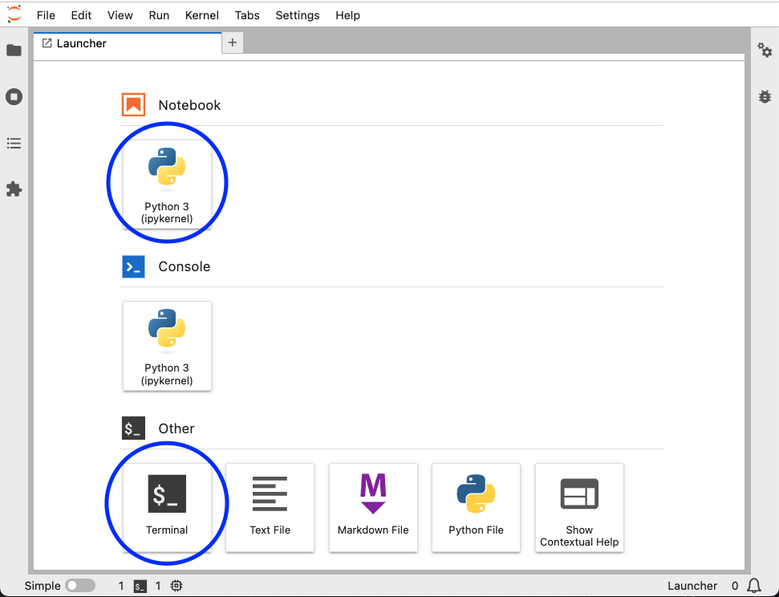
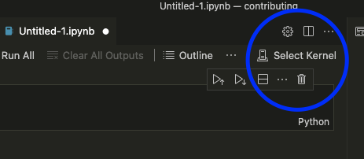

# Configuring your IDE

This section will show you how to configure your IDE. First, open a terminal and
activate the environment for the project you'll be working on:

```sh
conda environment ENV_NAME
```


```{important}
Take note on the `ENV_NAME`, since we'll need this value later.
```

## Verifying conda environment

Now, execute the following:

```sh
python -c 'import sys; print(sys.prefix)'
```

You should see something like this if you installed miniconda:

```
path/to/miniconda3/envs/ENV_NAME/bin/python
```

Or like this, if you installed Anaconda:

```
path/to/anaconda3/envs/ENV_NAME/bin/python
```

```{warning}
If the output does not contain `miniconda` or `anaconda`, send us a message on [Slack](https://ploomber.io/community) and we'll help you.
```


- [Click here](#jupyterlab) for JupyterLab instructions
- [Click here](#vscode) for VSCode instructions

## JupyterLab


```{warning}
Starting JupyterLab from another environment or Anaconda's graphical user interface might create issues. We highly recommend you install and start JupyterLab from the same conda environment, as described below.
```

If you want to use JupyterLab for developing, ensure you install and start it from
the same conda environment:

```sh
# activate environment
conda activate ENV_NAME

# install JupyterLab
pip install jupyterlab

# start JupyterLab
jupyter lab
```

Once JupyterLab opens, open a notebook, a terminal:



And run the following, in the notebook:

```python
import sys; print("sys.prefix:", sys.prefix)
```

Verify that the printed value is the same as you saw in the
[Verifying conda environment](#verifying-conda-environment) section (the `ENV_NAME`).


Now, open a terminal and run the following:

```sh
python -c 'import sys; print("sys.prefix:", sys.prefix)'
```

Then, ensure that what's printed is `ENV_NAME`; if it's not, then you'll have to
run `conda activate ENV_NAME` every time you open a terminal.

```{warning}
Once a package is imported in Jupyter, changes to the source code are not automatically reflected. You need to restart the kernel or enable [autoreload](https://ipython.readthedocs.io/en/stable/config/extensions/autoreload.html)
```

If you'll be contributing with code, go to the [Coding](../contributing/coding.md) section, if you'll
be contributing with documentation, go to the
[Building documentation](../documentation/build-doc.md) section.

## VSCode

When using VSCode, you must ensure that you're using the right Python installation.
You can easily set this by opening the
[command paletter](https://code.visualstudio.com/docs/getstarted/userinterface#_command-palette),
then typing `Python: Select Interpreter`:


Then, type the `ENV_NAME`. For example, if I'm
setting up JupySQL, `ENV_NAME` is `jupysql`, so once I type it, I'll see this:


And type enter. Then, whenever you open a terminal, the conda environment will be automatically activated:


If it doesn't execute automatically, you'll have to run the `conda activate ENV_NAME` command every time you open a terminal.

### VSCode notebooks

If you want to write notebooks from VSCode, you need to ensure that the right kernel is enabled. Once you open a notebook, click on "Select Kernel":



Then, select the `Python Environments...` option and type Enter:


Finally, type the `ENV_NAME`, choose the option that matches the location of the conda environment and press Enter:


