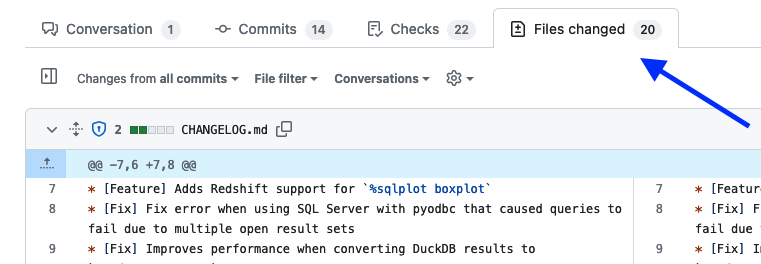
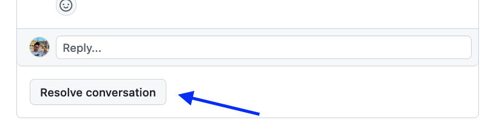

# Responding to PR reviews

Once you get a review, these are the guidelines to follow.

## Address all observations

**Address all review observations.** That doesn't mean you should change your code on
all observations but you should respond to all of them with a informative comment so
the reviewer knows what you did (addressed the changes, have questions about their
observations, etc.)

If a code change has been made, include a link to the changes so the reviewer
can find them quickly. First, click on `Files changed` in your PR:



Then, locate the code changes, click on the first line and drag it until the final line that you want to highlight. This will change the URL in your browser, copy the URl and include it as a link in your response:


For example, the above example generates the following link:

```md
https://github.com/ploomber/jupysql/pull/787/files#diff-15ef0e119ce73b542976f499fcc3cbb967d30af8199e058aec2bc77c30973061R105-R114
```

Then, your response can be:

```md
[fixed](https://github.com/ploomber/jupysql/pull/787/files#diff-15ef0e119ce73b542976f499fcc3cbb967d30af8199e058aec2bc77c30973061R105-R114)
```

## **Do not** mark the conversations as resolved

The reviewer is responsible for making conversations as resolved.



