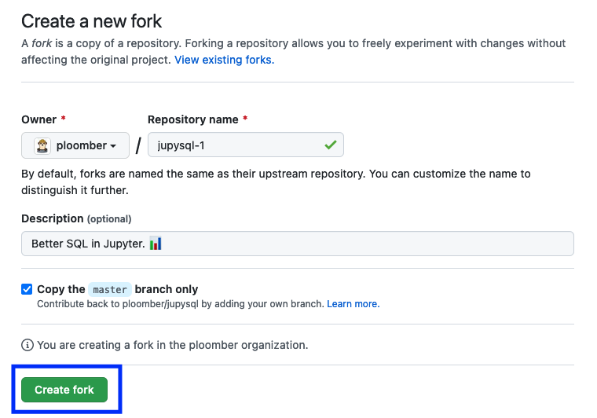

# Setting up

```{note}
If you get stuck in the contribution process, send us a message on [Slack](https://ploomber.io/community) and we'll help you.
```

This is a general guide applicable to all our projects (JupySQL, Ploomber, sklearn-evaluation, ploomber-engine, etc.). However, there might be particular details in some repositories so check out the `CONTRIBUTING.md` (located in the root directory) for the project you want to contribute to.

For a more detailed introduction to open-source contributions, check out our [blog post](https://ploomber.io/blog/open-source/).

This guide will help you:

1. Configure your development environment (necessary for both code and documentation contributions)
2. Crete a local copy of the project you'll contribute to

By the end of this tutorial, you'll be able to make changes to the code (or documentation), and test them locally.
## Pre-requisites

Setting up your environment requires [miniconda](https://docs.conda.io/en/latest/miniconda.html), once installed, verify it's working with:

```sh
conda --version
```

If `conda` is activated, you should see `(base)` as the prefix of your terminal prompt.

You also need `git`, ensure it's working by running the following:

```sh
git --version
```

Continue once `conda` and `git` are working.

## Creating a `conda` environment

Each Ploomber project you contribute we'll live in a separate `conda` environment, so let's first create a base environment to manage the others.

Create a `ploomber-base` environment:

```sh
conda create --name ploomber-base python=3.10 --yes
```

Activate the environment and install `pkgmt`:

```sh
conda activate ploomber-base
pip install pkgmt --upgrade
```

Verify installation:

```sh
pkgmt --help
```

If you don't see any errors, continue. Otherwise, message us on [Slack](https://ploomber.io/community).

## Forking and cloning the repository

To contribute to one of our projects, you need to fork it by clicking on this button:


Then, click on `Create fork`:



This will create a copy of the repository under your username:

```
https://github.com/YOUR_USERNAME/REPOSITORY_NAME
```

Once you forked it, use the terminal to clone the repository:

```sh
git clone https://github.com/YOUR_USERNAME/REPOSITORY_NAME
```


## Setup

```{warning}
Some of our projects have a `tasks.py` file in the root directory (e.g., [Ploomber](https://github.com/ploomber/ploomber)), if that's the case for the project you want to contribute to, go to the [next section](#setup-projects-with-taskspy)
```


First, ensure your current directory is the folder where you cloned the repository. For example if using Linux or macOS:

```sh
cd REPOSITORY_NAME
```

Now, let's setup your development environment. First, activate your base environment:

```sh
conda activate ploomber-base
```

Now, let's install the dependencies:

```sh
# if you want to build the documentation locally, pass --doc
pkgmt setup --doc

# this command will create a conda environment for you
pkgmt setup
```

By the end of the `pkgmt setup` command, you'll see something like this:

```sh
conda activate ENV_NAME
```

This is because the `pkgmt setup` command will create another conda environment that's
configured to contribute to the project you forked.

Before continuing, ensure you activate the environment:

```sh
conda activate ENV_NAME
```

```{note}
You have to repeat this process for every project you contribute to. For example, if you start contributing to [JupySQL](https://github.com/ploomber/jupysql), and then you are contributing to [ploomber-engine](https://github.com/ploomber/ploomber-engine), you'll have to setup again.
```

Now, let's check your [fork and IDE settings.](coding)

## Setup (projects with `tasks.py`)

If the project you want to contribute has a `tasks.py` file, follow these instructions.

Let's setup your development environment:

```sh
pip install invoke --upgrade

# if you want to build the documentation locally, pass --doc
invoke setup --doc

# this command will setup the development environment
invoke setup
```

By the end of the `invoke setup` command, you'll see something like this:

```sh
conda activate ENV_NAME
```

This is because the `invoke setup` command will create another conda environment that's
configured to contribute to the project you forked.

Before continuing, ensure you activate the environment:

```sh
conda activate ENV_NAME
```

```{note}
You have to repeat this process for every project you contribute to. For example, if you start contributing to [JupySQL](https://github.com/ploomber/jupysql), and then you are contributing to [ploomber-engine](https://github.com/ploomber/ploomber-engine), you'll have to setup again.
```


Now, let's check your [fork and IDE settings.](coding)

