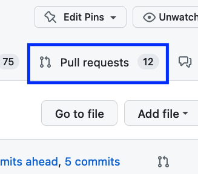
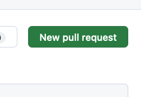
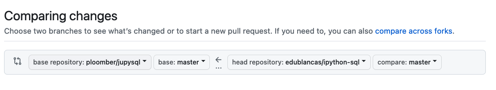
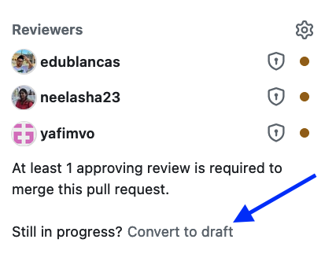
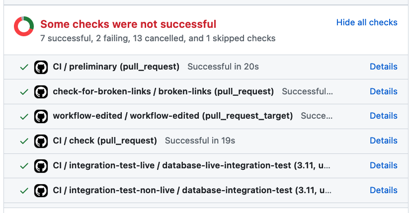
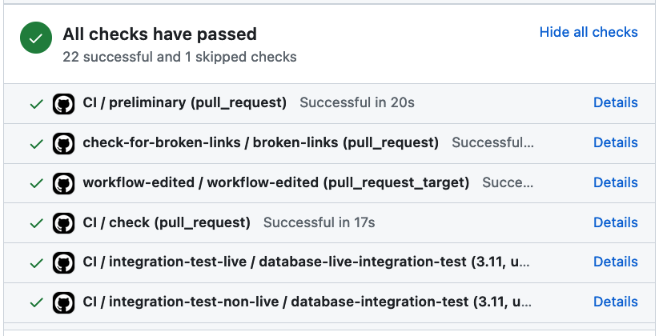
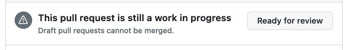
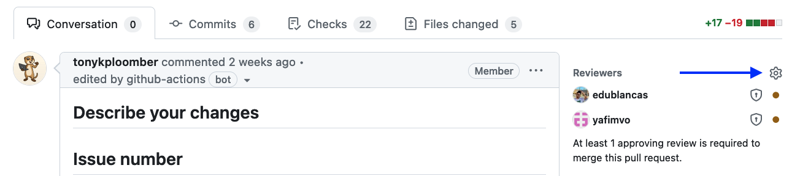
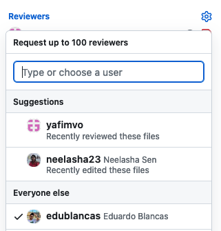
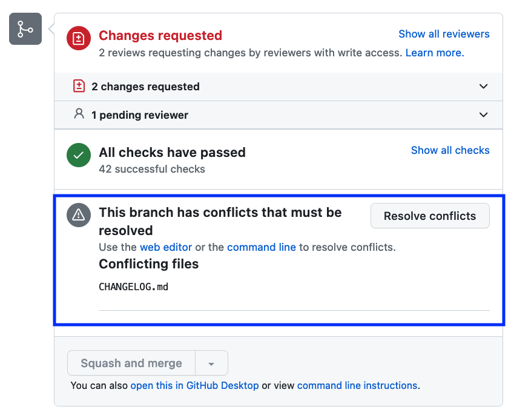

# Submitting a PR

```{tip}
Don't wait to finish the work to open a Pull Request, you can open a draft PR to request feedback. Furthermore, opening a Pull Request will run our unit tests to catch any potential errors early.
```

This tutorial will help you understand everything you need to know for opening a Pull Request.


## Linting/Formatting

Before submitting a Pull Request, run the following command to apply some automated formatting:

```sh
pip install pkgmt --upgrade
pkgmt format
```

Then, you can lint the code to check for formatting errors:

```sh
pip install pkgmt --upgrade
pkgmt lint
```

Although `pkgmt format` is able to fix most issues; there might be some of them that need manual fixes so ensure you tackle them all.

To automatically lint your code before pushing:

```sh
pip install pkgmt --upgrade
pkgmt hook
```

The command above will install a git pre-push hook. To uninstall:

```sh
pkgmt hook --uninstall
```

## CHANGELOG

Each repository contains a `CHANGELOG` file in the root directory. Each PR should
contain a list of items, so we keep it up-to-date. Note that the `CHANGELOG` targets
end-users (while `git log` targets the Ploomber development team); this implies
that there might be changes that we don't include in the `CHANGELOG`, but they exist
in the `git log`, for example changes to the CI configuration, new tests
added/fixed.

These are changes that we add to the `CHANGELOG` (in this order):

- [API Change] API breaking changes
- [Feature] New features
- [Fix] Bug fixes
- [Doc] Important documentation changes (e.g., new sections, major re-organization)

Each new line in the `CHANGELOG` must be prefixed by its category. Example:

```md
- [Fix] Fixes an error that caused function `do_something` to break when passing `0` as input
```

If there is an issue related to the change, it should be added to the end:

```md
- [Fix] Fixes an error that caused function `do_something` to break when passing `0` as input (#99)
```

Note that we're not adding the link to GitHub, this will happen automatically during the release process.

```{tip}
We want to recognize your work: If you wish, you can add your GitHub handle next to your changelog entry! Example:

~~~md
- [Feature] Add a very important feature (by @edublancas)
~~~
```

### Rules of thumb for CHANGELOG messages

Keep in mind this guidelines when writing changelog messages:


- Use full sentences
    - Example: [Fix] Fix an error that caused the function `do_something` to break when passing `0` as an input
- Appropriately identify modules, functions or classes affect with backticks (`) and write the name exactly as it appears on the source code (do not use abbreviations)
    - Example: [Feature] Add `some_module.Report` to generate reports from profiling data


## Testing

Testing our codes ensures that it's working as expected, so writing tests is an essential part of the contribution process. If you're contributing with a new feature, you'll have to write new tests from scratch. On the other hand, if you're fixing a bug, you might have to modify existing tests and add new tests to ensure that the bug has been fixed.

Ensuring that your new feature works is just as important as ensuring that we're helping the user when things don't work as expected. For example, say you're working on a function named `add` that adds two numbers:

```python
def add(x, y):
    return x + y
```

A test might look like this:

```python
def test_add():
    assert add(21, 21) == 42
```

However, you should also take into account scenarios where the function doesn't work,
for example, if the user calls the function with a string: `add("21", 21)`, they'll
see the following error:

```
TypeError: can only concatenate str (not "int") to str
```

The error is difficult to understand, so you should ensure that you're covering likely
scenarios (they don't have to be exhaustive but try to think what the user might do).
After encountering such edge case, you can add a new test:


```python
def test_error_if_wrong_type():
    with pytest.raises(TypeError) as excinfo:
        add(21, 21)

    message = "function add only supports numbers, you passed a str object in the first argument ('21')"
    assert str(excinfo).value == message
```

Of course, the test won't pass since you haven't implemented such validation, but you can now go, implement it and verify that the test passes.


* We use [pytest](https://docs.pytest.org/en/7.2.x/) for testing. A basic understanding of `pytest` is highly recommended to get started, especially [fixtures](https://docs.pytest.org/en/7.2.x/fixture.html), [parametrization](https://docs.pytest.org/en/7.2.x/parametrize.html), and [debugging](https://docs.pytest.org/en/7.2.x/how-to/failures.html)
* In most cases, for a given in `src/ploomber/MODULE_NAME`, there is a testing module in `tests/MODULE_NAME`, if you're working on a particular module, you can execute the corresponding testing module for faster development but when submitting a pull request, all tests will run
* If you're checking error messages and they include absolute paths to files, you may encounter some issues when running the Windows CI since the Github Actions VM has some symlinks. If the test calls `Pathlib.resolve()` ([resolves symlinks](https://docs.python.org/3/library/pathlib.html#id5)), call it in the test as well, if it doesn't, use `os.path.abspath()` (does not resolve symlinks).

Before running the unit tests locally, ensure you're in the right conda environment. To list environments:

```sh
conda env list
```

To activate an environment:

```sh
conda activate ENV_NAME
```

In most cases, to run the tests, you must run:

```sh
pytest
```

However, some projects require specific arguments, to know what's the right argument, check out the `.github/workflows` directory, where you'll find the configuration file for running tests (usually named `ci.yml`). There, you'll see how we're running tests. For example in JupySQL's case, we run [this command](https://github.com/ploomber/jupysql/blob/84c299624b97f743bdcef447292988e505f9d3e0/.github/workflows/ci.yaml#L39):

```sh
pytest --durations-min=5 --ignore=src/tests/integration
```

## Documenting changes and new features

The documentation must be updated when you make changes to the API (add arguments, add a new class, etc.) (we use the [numpydoc](https://numpydoc.readthedocs.io/en/latest/format.html) format).

We keep track of API changes in the the `Notes` section, by using the `.. versionadded` directive for new classes, functions, or methods.

For example, if we added `SomeClass` in version `1.2` and `some_method` in `1.3`:

```python
class SomeClass:
    """
    Notes
    -----
    .. versionadded:: 1.2
    """
    def some_method(self, existing, new):
        """
        Parameters
        ----------
        existing : bool, default=None
            Some description

        new : str, default=None
            Another description (Added in version X.Y.Z)

        Notes
        ----
        .. versionadded:: 1.3
        """
        pass
```

Apart from docstrings, we often write tutorials and examples, for more information, check out our [documentation framework.](../maintainer/doc-guide.md)

### Which version to put?

If your change is not making breaking API changes, look at the current development version in the `CHANGELOG.md` file, then drop the `dev` portion.

If the change breaks the API, the version will be handled case by case. However, in most situations, the change will be scheduled for the next major release. For example, if the `dev` version is `0.20.1dev`, the next major release is `0.21`.

## Backwards compatibility

When breaking the API, we give heads up nnotice to our users so they have enough time to update their code. This involves showing warnings letting them know that a certain feature will be deprecated.

We currently do not have a strict policy so we review cases on a case-by-case basis, but a good rule of thumb is to give at least a month's notice. This implies that Code Owners should ensure that the contributor opens a new PR with deprecation warnings, we merge the PR, and make a new release (by notifying Eduardo or Ido). This process should be prioritized so we make a release as soon as we decide that we'll break the API.

To deprecate code, use the [module in `ploomber-core`.](https://ploomber-core.readthedocs.io/en/latest/deprecation.html)

> **Note**
> ploomber-core must be used for deprecations in most cases. The only exception are some JupySQL modules where we manually show exceptions using the `warnings` module since the API is a [Jupyter magic](https://ipython.readthedocs.io/en/stable/interactive/magics.html), which is currently not compatible with ploomber-core.


When the API is changed, we must bump to a major version release. A major release is a bump in the middle number in `X.Y.Z`. For example, if our current development version is `0.1.3dev`, the first step is to add the deprecation warnings and make the  `0.1.3` release, then, in the PR that breaks the API, we should ensure that the development version is set to `0.2.0dev` in the `CHANGELOG` and `__init__.py` file.


## Telemetry

To measure usage, we add telemetry to our packages. See the [user guide.](https://ploomber-core.readthedocs.io/en/latest/telemetry.html)

## Optional dependencies

If the feature you're implementing requires extra packages, we might consider adding them as optional dependencies. [Check out the guide.](https://ploomber-core.readthedocs.io/en/latest/dependencies.html)


## Opening a Draft Pull Request

```{important}
Assuming your PR passes all tests, **you should get a review within 24 hours.** If you don't, you can tag/notify the reviewer (they might've missed the notification).
```

To open a Pull Request, open the *original repository* on GitHub, then click on:



Then:



Finally, click on compare across forks:



Then ensure the menu displays the original repository (`ploomber/PROJECT_NAME`) on the left, and your fork on the right (`YOURUSERNAME/PROJECT_NAME`). Also, ensure you select the appropriate branch from your fork on the right. The format should be as follows:

```
base repository: ploomber/PROJECT_NAME base: main (or master) ⬅️ head repository: YOURUSERNAME/PROJECT_NAME compare: YOURBRANCH
```

Then click on open **Draft Pull Request.**


```{tip}
If you open a **Ready to review PR** by mistake, you can convert it into a draft by
clicking on "convert to draft" in the right side bar:


```

Opening a PR will trigger building documentation and running the tests. Wait for a few minutes (most of our tests run in
<15 minutes). If the checks failed:



Check the logs and fix them (see the [troubleshooting](troubleshooting.md) guide
for tips). If you're unable to fix the issues after spending some time on them, you
can message us on Slack.

Once the tests pass:




Ensure there are no [merge conflicts](#fixing-merge-conflicts).

If all the test pass and there are no merge conflicts, you can [request a review](#requesting-a-review).

```{important}
If your PR isn't ready yet, open it as a draft. Keep it as a draft until it's ready for review.
```

## Requesting a review

Once your PR is ready, you must request a review. In some of our repositories, the
review is requested automatically once you click on "Ready for review":



But if the reviewers list looks empty, you can request a review by clicking on the
gear icon ⚙️ in the reviewers section (in the right bar):



And then add `@edublancas` and `@idomic` as reviewers.



```{note}
If the gear ⚙️ button isn't visible, tag `@edublancas` in a comment so he can fix
GitHub permissions.
```

## Fixing merge conflicts

```{note}
Fixing merge conflicts can be tricky. If you have issues, message us on [Slack.](https://ploomber.io/community)
```

By the time your Pull Request is ready to merge, the original repository might have changed, which might cause merge conflicts (displayed at the bottom of the PR):



In a few cases, these merging conflicts are easy to fix and you can do it via GitHub by clicking on the "Resolve conflicts" button manually.

However, most of the time, it's better to fix them from the command line. You have a few options.

In all cases, ensure you've [synced your fork.](coding.md#syncing-your-fork)

```{tip}
If you're new to `git`, we recommend you create a backup branch before proceeding:

~~~sh
# move to the branch where you been working
git checkout YOURBRANCH

# create a backup
git checkout -b YOURBRANCH-BACKUP
git push

# go back to the old branch
git checkout YOURBRANCH
~~~
```

### `git merge`

```sh
# move to the main branch (or master branch in some repositories)
git checkout main

# pull the latest changes
git pull

# move to the branch where you been working
git checkout YOURBRANCH

# merge
git merge
```

During the merge operation, you might have to solve merge conflicts. If you need help, message us on [Slack.](https://ploomber.io/community)

### `git rebase`

Rebase is recommended for advanced users. [Click here to learn more.](https://www.atlassian.com/git/tutorials/rewriting-history/git-rebase)

During the rebase operation, you might have to solve merge conflicts. If you need help, message us on [Slack.](https://ploomber.io/community)