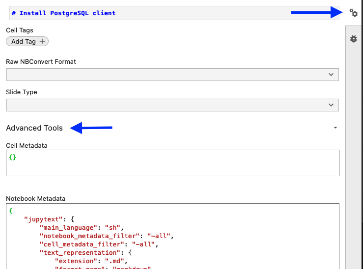

# SEO

## HTML metadata

### `.md` files

```yaml
---
jupytext:
  formats: md:myst
  text_representation:
    extension: .md
    format_name: myst
    format_version: 0.13
    jupytext_version: 1.14.4
kernelspec:
  display_name: Python 3 (ipykernel)
  language: python
  name: python3
html_meta:
  description lang=en: "Some description"
  keywords: "Key1, Key2"
  property=og:locale: "en_US"  
---
```

### `.ipynb` files

```json
{
    "html_meta": {
        "description lang=en": "Description",
        "keywords": "Key1, Key2",
        "property=og:locale": "en_US"
    }
}
```

To open the metadata editor:



### `.rst` files

```rst
.. meta::
    :description lang=en:
        Some description
    :keywords: Tag1, Tag2
```
