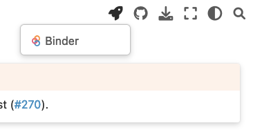

# Maintainer's guide

This guide documents the process for code maintainers.

## Roles

- **Reviewer:** Performs code reviews for Pull Requests; their objective is to ensure code quality
- **Owner:** Reviews code, ensures that Pull Requests do not get stalled, clicks the **squash and merge** button, and is responsible for ensuring the that we ship functional, high-quality code

### Which one am I?

- You're a reviewer if someone from the team has requested your review on GitHub
- You're an owner if the `Owner: YourFirstName` label has been applied to the GitHub issue or Pull Request

> **Note**
> A contributor cannot be the owner of their Pull Request

Currently, we're testing this with some members of the team (in alphabetical order):

- [Issues/PRs owner by Eduardo](https://github.com/issues?q=is%3Aopen+org%3Aploomber+label%3A%22Owner%3A+Eduardo%22)
- [Issues/PRs owner by Ido](https://github.com/issues?q=is%3Aopen+org%3Aploomber+label%3A%22Owner%3A+Ido%22)
- [Issues/PRs owner by Tony](https://github.com/issues?q=is%3Aopen+org%3Aploomber+label%3A%22Owner%3A+Tony%22)
- [Issues/PRs owner by Yafim](https://github.com/issues?q=is%3Aopen+org%3Aploomber+label%3A%22Owner%3A+Yafim%22)


## Reviewer/Owner checklist

When performing a code review, verify the following:

- Unit tests have been added and they're rigorously testing the code changes
- An appropriate [CHANGELOG](../contributing/coding.md#changelog) entry has been added (when needed)
- The code meets the quality bar
    - Re-usable (e.g., abstracts common patterns in functions)
    - Clear (i.e., descriptive variable names, inline comments when needed) - this also applies to unit tests
- New features are documented: either a [docstring example](https://sklearn-evaluation.ploomber.io/en/latest/api/plot.html#confusionmatrix) (for minor features) or a full [tutorial](https://jupysql.ploomber.io/en/latest/integrations/duckdb.html) (major features) and the documentation is clear an concise

Owners also have the following responsibilities:

- If breaking API changes are introduced, a PR is merged with a [deprecation warning](../contributing/coding.md#maintaining-backwards-compatibility)
- If breaking API changes are introduced: a [major version bump](../contributing/coding.md#maintaining-backwards-compatibility) is performed
- Ensure that all CI checks passed before merging a Pull Request
- [Only applicable for PRs from external contributors] Approve CI executions (when an external contributor opens a PR, someone from the team needs to approve the CI run by clicking on a button)
- If the CI fails, provide guidance to the contributor. If you suspect the CI is broken due an external factor (e.g., a dependency that its API), send a message on Slack
- If the Pull Request does not meet the quality bar, address it with concrete action items to the contributor
- Run [quality assurance](#quality-assurance) and use your best judgment to determine if this is ready to be merged to the main branch

## Quality assurance

The easiest way to test code contributions is via Binder (a hosted JupyterLab). When
reviewing a pull request, click on the [documentation link](../maintainer/doc-guide.md#previewing-docs).

If the Pull Request is introducing a new feature that includes an interactive
tutorial, navigate to it. If not, stay in the home page.

Launch Binder by clicking on the 🚀 button at the top, then click on "Binder":



Once it loads, you'll be able to test the code from the Pull Request.


**Note:** If Binder is misconfigured (i.e., does not load or the code does not match the Pull Request), let us know. Also, always verify the link you're clicking to ensure there isn't any misconfiguration, the format is as follows:

For Pull Requests opened from branches in the original repository

```
https://binder.ploomber.io/v2/gh/ploomber/NAME/BRANCH?urlpath=path/to/notebook
```

Pull Requests opened from forks:

```
https://binder.ploomber.io/v2/gh/USER/NAME/BRANCH?urlpath=path/to/notebook
```

When testing the code: put yourself in the user's shoes (who has never executed this code) and ask yourself if it's clear what the new code is doing and how it can benefit them. These are some questions to ask yourself:

- Is this feature easy to discover? (e.g., via documentation)
- Is the documentation clear for me to understand why should I care?
- Is it easy to get started?
- When things break under simple scenarios, is it easy to know how to fix it/ask for help? (we encourage you to break the code!)
- Is the API consistent? Verify if there might be potential issues with existing features or if the new code itself is inconsistent (e.g., there are no naming conventions, confusing parameter names) 

> **Note**
> If you consider that there are missing parts in the PR, 
> use your best jugment to determine if those missing pieces are critical (e.g., unclear
> documentation, inconsistent API) or not (e.g., documentation could be a bit clearer,
> some extra examples needed). In the former case, we should not merge the PR, but in
> the latter case we should merge it and you can open a new issue to discuss further
> improvements.

## Continuous integration

We use GitHub Actions to test our projects. Each one should test against these configuration:

- OS: macOS, Linux, and Windows
- Python version: 3.7, 3.8, 3.9, 3.10
- [Documentation preview](https://github.com/readthedocs/actions/tree/v1/preview)
- General checks (via `pkgmt check`)
- Multiprocessing the tests via [pytest-xdist](https://github.com/pytest-dev/pytest-xdist)
